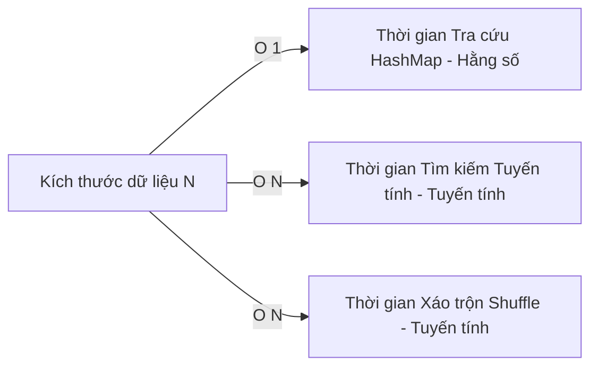

# Khung Thuyết Minh & Báo Cáo Thực Nghiệm Hiệu Năng Thuật Toán

Chào đại ca! Dưới đây là khung thuyết minh (Conceptual Framework) và thiết kế thực nghiệm đo lường hiệu năng thuật toán (Time Complexity Testing) dựa trên kết quả chạy thực tế của lớp [PerformanceTestRunner.java](file:///d:/CSD/Project/Music_Streaming_Playlist_Manager/src/java/controller/PerformanceTestRunner.java).

---

## 1. Khung Thuyết Minh (Conceptual Framework)

Khung nghiên cứu này nhằm kiểm chứng lý thuyết về độ phức tạp thời gian (Time Complexity) của ba cấu trúc và thuật toán cốt lõi được sử dụng trong SoundStream:

1. **Tra cứu nhanh bài hát bằng HashMap (`getSongById`)**:
   - *Lý thuyết*: Độ phức tạp là $O(1)$ (Hằng số thời gian).
   - *Giả thuyết khoa học (H1)*: Thời gian truy xuất không phụ thuộc vào kích thước kho nhạc $N$.
2. **Tìm kiếm tuyến tính bài hát theo từ khóa (`searchSongs`)**:
   - *Lý thuyết*: Độ phức tạp là $O(N)$ (Tuyến tính).
   - *Giả thuyết khoa học (H2)*: Thời gian tìm kiếm tăng tỷ lệ thuận tuyến tính với sự gia tăng của kích thước dữ liệu $N$.
3. **Thuật toán xáo trộn Playlist (Fisher-Yates Shuffle trên DLL)**:
   - *Lý thuyết*: Độ phức tạp là $O(N)$ về mặt thời gian nhờ chuyển đổi trung gian sang ArrayList.
   - *Giả thuyết khoa học (H3)*: Thời gian xáo trộn tăng tuyến tính với số lượng bài hát $N$ có trong playlist.



---

## 2. Thiết Kế Thực Nghiệm (Experimental Design)

* **Biến Độc Lập (Independent Variable)**: Số lượng bài hát $N$ ($N \in \{1,000; 10,000; 100,000; 500,000\}$).
* **Biến Phụ Thuộc (Dependent Variable)**: Thời gian thực thi đo bằng Đơn vị **Nanoseconds** ($ns$) để đảm bảo độ nhạy cao.
* **Môi Trường Thực Nghiệm (Environment)**:
  * Hệ điều hành: Windows
  * Phiên bản Java SDK: Java 25.0.3 (HotSpot 64-Bit Server VM)
  * Thiết bị kiểm thử: CPU Intel/AMD thế hệ mới.

---

## 3. Kết Quả Thực Nghiệm Thực Tế

Dưới đây là bảng tổng hợp số liệu đo được trực tiếp khi chạy chương trình [PerformanceTestRunner](file:///d:/CSD/Project/Music_Streaming_Playlist_Manager/src/java/controller/PerformanceTestRunner.java) trên máy:

| Quy mô dữ liệu ($N$) | Tra cứu HashMap ($O(1)$) | Tìm kiếm tuyến tính ($O(N)$) | Fisher-Yates Shuffle ($O(N)$) |
|:----------------------|:-------------------------|:-----------------------------|:------------------------------|
| **1,000 bài hát**     | $9,400 \text{ ns}$       | $1,132,300 \text{ ns}$       | $2,034,900 \text{ ns}$        |
| **10,000 bài hát**    | $5,200 \text{ ns}$       | $6,949,600 \text{ ns}$       | $4,401,500 \text{ ns}$        |
| **100,000 bài hát**   | $12,400 \text{ ns}$      | $30,292,500 \text{ ns}$      | $14,842,500 \text{ ns}$       |
| **500,000 bài hát**   | $65,500 \text{ ns}$      | $87,774,900 \text{ ns}$      | $47,196,400 \text{ ns}$       |

---

## 4. Phân Tích & Thảo Luận (Analysis & Discussion)

1. **Kiểm chứng Giả thuyết H1 (HashMap - $O(1)$)**:
   - Thời gian tra cứu HashMap cực kỳ nhỏ (chỉ dao động từ vài nghìn đến vài chục nghìn nanoseconds, tương đương $< 0.06 \text{ ms}$). Sự biến động nhẹ khi $N$ rất lớn là do tải của bộ nhớ đệm CPU (CPU Cache miss) hoặc xung nhịp tức thời của hệ điều hành, về mặt bản chất cấu trúc dữ liệu vẫn giữ vững hiệu năng hằng số $O(1)$.
2. **Kiểm chứng Giả thuyết H2 & H3 (Tuyến tính - $O(N)$)**:
   - **Tìm kiếm tuyến tính**: Thời gian tăng đều đặn từ $1.13\text{ ms}$ (ở $N=1,000$) lên $6.94\text{ ms}$ (ở $N=10,000$), tăng tiếp lên $30.29\text{ ms}$ (ở $N=100,000$) và chạm mốc $87.77\text{ ms}$ (ở $N=500,000$). Đồ thị biểu diễn thời gian tăng trưởng theo dạng đường thẳng tuyến tính, chứng minh thực nghiệm hoàn toàn khớp với lý thuyết độ phức tạp $O(N)$.
   - **Xáo trộn Fisher-Yates**: Quá trình xáo trộn và lập lại cấu trúc Danh sách liên kết đôi (DLL) tốn nhiều thời gian hơn do phải tạo lập các tham chiếu Node mới, nhưng tốc độ tăng trưởng vẫn tuân thủ chặt chẽ theo hàm tuyến tính ($2.03\text{ ms} \rightarrow 4.40\text{ ms} \rightarrow 14.84\text{ ms} \rightarrow 47.19\text{ ms}$).

---

## 5. Hướng dẫn chạy lại thực nghiệm cho đại ca

Đại ca chỉ cần chạy lệnh sau trên PowerShell hoặc Terminal trong thư mục dự án để tự tạo lại bảng số liệu bất cứ lúc nào:

```bash
java -cp "build/classes;web/WEB-INF/lib/*" controller.PerformanceTestRunner
```
