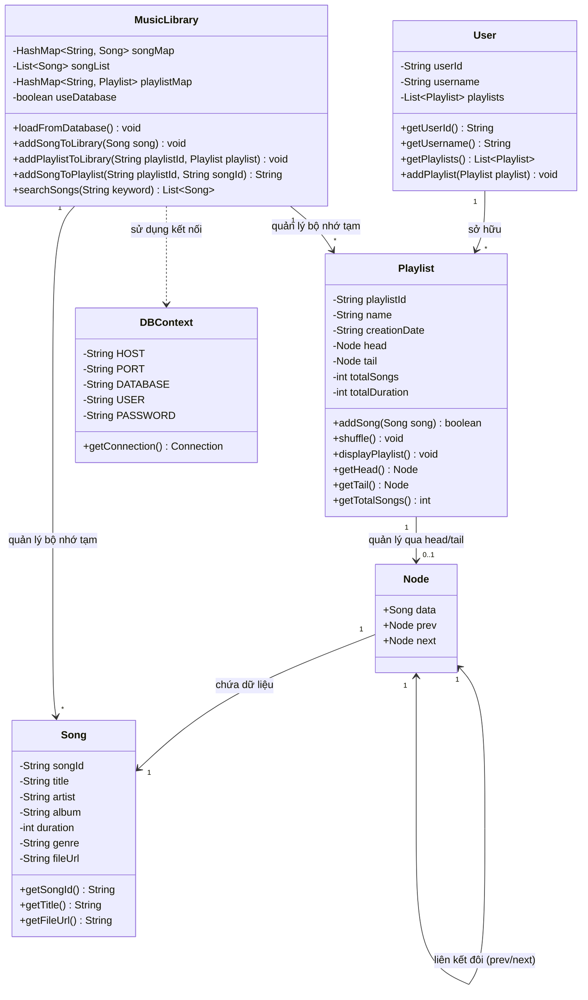
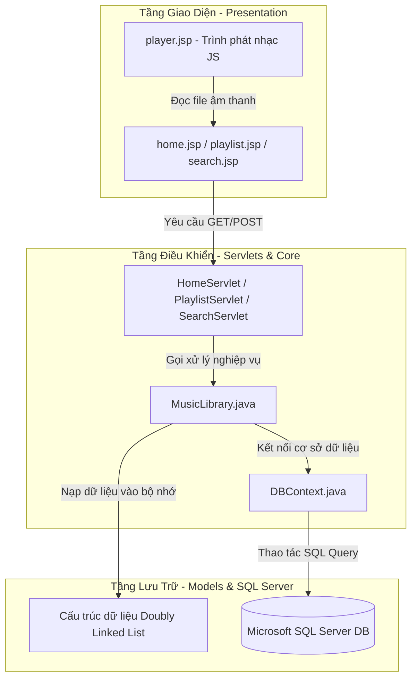
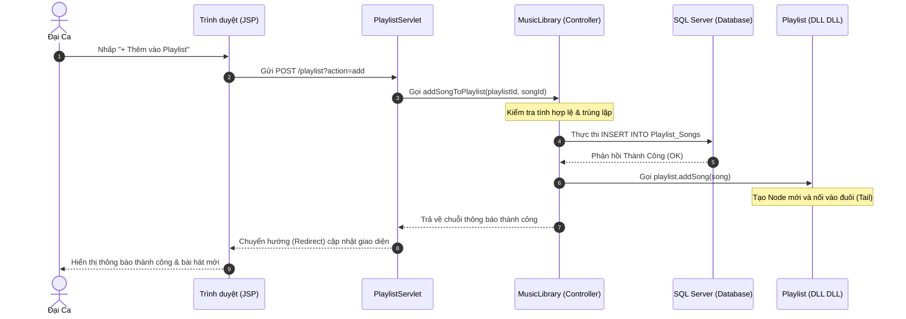

# Thiết kế UML & Kiến trúc Hệ thống SoundStream

Chào đại ca! Dưới đây là tài liệu mô tả kiến trúc hệ thống trực quan sử dụng UML (Unified Modeling Language) để đại ca dễ dàng nộp báo cáo cho thầy.

---

## 1. Sơ đồ lớp UML (Class Diagram)
Sơ đồ này mô tả cấu trúc của các thực thể dữ liệu (Models), cấu trúc Danh sách liên kết đôi (Doubly Linked List) và các thành phần nghiệp vụ (Controllers).

---

## 2. Kiến trúc thành phần (Component / Layered Architecture)
Mô tả cách phân chia tầng (N-Tier) từ Giao diện $\rightarrow$ Controller $\rightarrow$ Database.

---

## 3. Sơ đồ tuần tự: Quy trình Thêm bài hát & Đồng bộ Database (Sequence Diagram)
Mô tả luồng đi của dữ liệu từ khi đại ca bấm nút thêm bài hát trên giao diện JSP cho đến khi dữ liệu được ghi nhận vào SQL Server.

